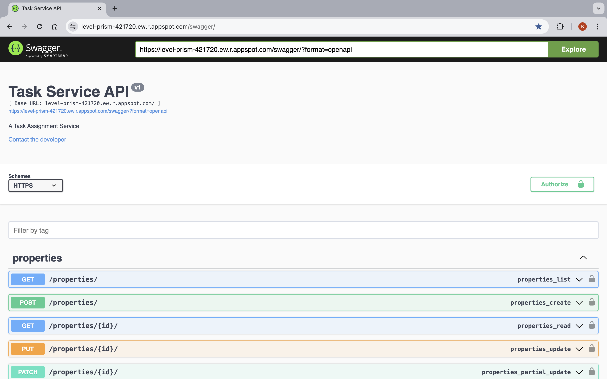
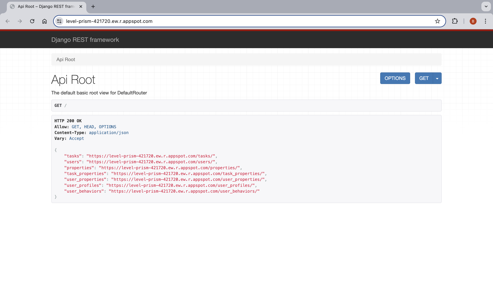

## Description
A task outsourcing system featured with personalized task recommendations. It provides api endpoint to access the data models in the system. However, the access and actions are protected and restricted based on the role of the authenticated users and their ownership. 

**Task Creation**

Only users who signed up as 'employer' are granted the permission to create tasks. Once a task is created, the creator will automatically take its ownership. Ownership is not transferable. 

**Task Assignment**

Users who signed up as 'employee' have the right to assign and unassign themselves from a selected task. However users cannot unassign themselves from a task once it has been submitted for review.

Users can either view all unassigned tasks to select tasks to start with or use the personalized task recommendation. Newly created tasks will be put to task pool and can be ranked for each user uniquely. 

**Task Recommendation**

Available unassigned tasks are ranked based on summed normalized scores from task's own characteristics, user's preferences (interests, what kind of tasks a user is interested or unintersted in), user's historical completed tasks and user's behaviors (what task a user has liked or disliked) by considering task similarities.

**Task Submission, Review, Deactivation**

Tasks can be submitted by task assignees for review. Task owners will then have the responsibility to review and approve a task. Only task owners can deactivate / delete a task they own.


## Deployment
The app is deployed on Google Cloud 

##  Demo

Staging swagger API page



Staging API page 



Video example


https://github.com/user-attachments/assets/49e937f2-aaad-4bea-9a63-8c74c4e8adf8


https://github.com/user-attachments/assets/3445951f-a85d-4043-9c95-3f86e5411f80


If the video doesn't play, [click here to download](https://github.com/carrottoo/task_service/blob/main/media/demo_of_api.mp4).


## Development

#### To install all dependecies
run
```
poetry install
```

#### To run locally in dev mode
run
```bash
export DJANGO_DEBUG=true
python manage.py runserver
```

#### To generate the static files
```bash
python manage.py collectstatic
```

#### To run tests
run
```bash
python manage.py test
```
**To see the test running details**

run
```bash
python manage.py test --verbosity=2
```
